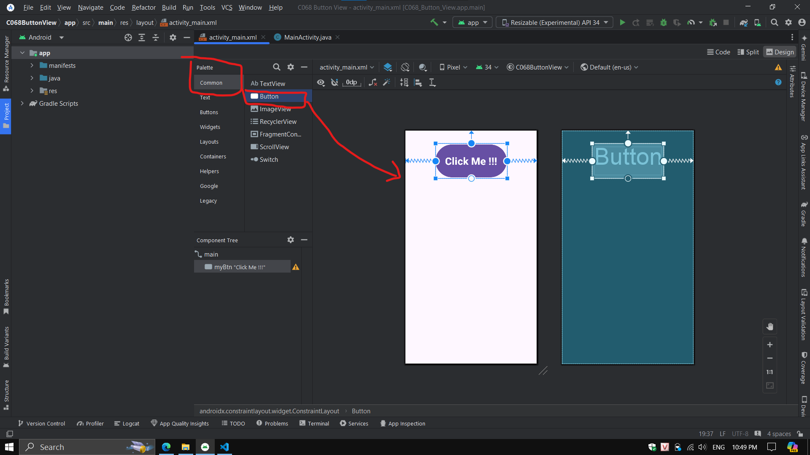
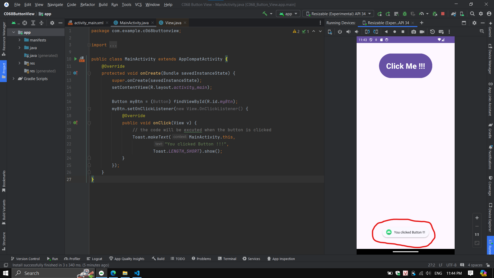

# __BUTTON__

- Button là 1 phần tử UI cơ bản, nó trình diễn 1 biểu tượng có khả năng click
- Button cho phép user thực hiện hành động hoặc kích hoạt 1 sự kiện nào đó bằng cách click vào nó

## __DESIGN BUTTON__

- có 2 cách design 1 Button
    - drag drop
    - code XML

- để drag drop EditText vào layout, trong file xml thiết kế
    - chọn tab design
    - trong Pallet quản lý View chọn Common
    - danh sách các View thuộc về Common chọn Button
    - kéo Button thả vào màn hình layout



- sử dụng code xml, trong file xml, khai báo tag \<Button /> bên trong View Group Layout

```xml
<?xml version="1.0" encoding="utf-8"?>
<androidx.constraintlayout.widget.ConstraintLayout xmlns:android="http://schemas.android.com/apk/res/android"
    xmlns:app="http://schemas.android.com/apk/res-auto"
    xmlns:tools="http://schemas.android.com/tools"
    android:id="@+id/main"
    android:layout_width="match_parent"
    android:layout_height="match_parent"
    tools:context=".MainActivity">

    <Button
        android:layout_width="wrap_content"
        android:layout_height="wrap_content"
        android:id="@+id/myBtn"
        android:text="Click Me !!!"
        android:textSize="32sp"
        android:textStyle="bold"

        android:padding="30dp"
        android:layout_margin="40dp"

        app:layout_constraintTop_toTopOf="parent"
        app:layout_constraintLeft_toLeftOf="parent"
        app:layout_constraintRight_toRightOf="parent"/>

</androidx.constraintlayout.widget.ConstraintLayout>
```

> vì đang sử dụng ViewGroup ConstrantLayout, nên bất kỳ View nào bên trong ViewGroup đều phải có ít nhất 3 điểm constraint

## __TƯƠNG TÁC LẬP TRÌNH VỚI BUTTON__

- với tất cả các View, để tương tác được với chúng trong code chương trình cần:
    - khai báo ĐÚNG đối tượng View
    - khởi tạo tham chiếu chính xác đến ``id`` đã được khai báo trong layout đến View thông qua method ``findViewById(int)``

- với Button ta khai báo khởi tạo như sau
```java
Button myBtn = (Button) findViewById(R.id.myBtn);
```

- để sử dụng Button, hay để user click vào Button nhằm thực hiện 1 hành động, hay sự kiện user click vào Button sẽ thực hiện 1 hành động nào đó
- thông qua instance của Button hay đối tượng Button là ``myBtn`` gọi đến method ``setOnClickListener`` và truyền vào tham số là anonymous object của interface ``OnClickListener``

> tham số truyền vào setOnClickListener chỉ cần gõ ``new On`` Android sẽ tự động hoàn thành code đăng ký Listener

```java
        myBtn.setOnClickListener(new View.OnClickListener() {
            @Override
            public void onClick(View v) {
                // the code will be excuted when the button is clicked
            }
        });
```
- khi user click vào Button, thì những gì trong method ``onClick`` sẽ được thực hiện

## __EVENT LISTENER LÀ GÌ__

- Event Listener là 1 interface trong class View chứa duy nhất 1 callback method
- method callback hay Event Handler này sẽ được gọi bởi Android framework khi View (Button, TextView, ...) đã đăng ký listener được kích hoạt bằng sự tương tác của user đến View đó
- có nhiều loại Event Listener khác nhau, đi kèm với mỗi loại sẽ có 1 Event Handler
- để sử đăng ký Event Listener cho Button khi user click vào Button, từ instance của Button gọi đến method ``setOnClickListener(new View.OnClickListener()``
- ``new View.OnClickListener()`` là EventListener hay functional interface có duy nhất 1 method, ta phải override lại method của nó, hay còn gọi là callback method, bên trong callback method này ta sẽ định nghĩa các việc cần làm khi user click vào Button
- giả sử khi user click vào Button ta muốn feedback 1 thông báo Toast lên màn hình user

```java
public class MainActivity extends AppCompatActivity {
    @Override
    protected void onCreate(Bundle savedInstanceState) {
        super.onCreate(savedInstanceState);
        setContentView(R.layout.activity_main);

        Button myBtn = (Button) findViewById(R.id.myBtn);
        myBtn.setOnClickListener(new View.OnClickListener() {
            @Override
            public void onClick(View v) {
                // the code will be excuted when the button is clicked
                Toast.makeText(MainActivity.this,
                        "You clicked Button !!!",
                        Toast.LENGTH_SHORT).show();
            }
        });
    }
}
```

